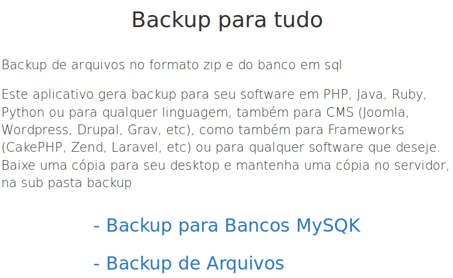
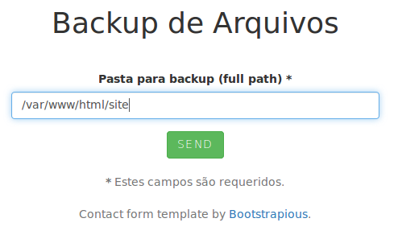
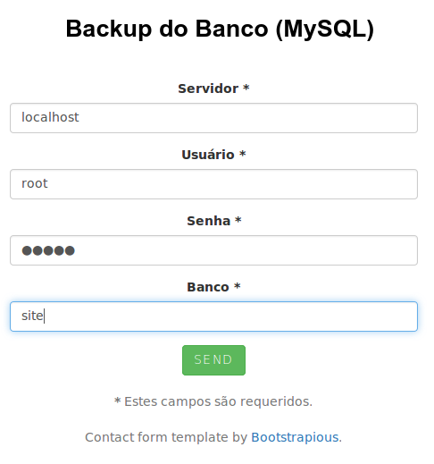

# backup-for-all

Backup web files in zip package and/or database in sql file for any applications or site.

This software make backup to your software in PHP, Java, Ruby, Python or any language, CMS (Joomla, WordPress, Drupal, Grav, etc), applications (CakePHP, Zend, Laravel, etc) or any software.

## Download
https://github.com/ribafs/backup-for-all

**Download ans Server**

Download one copy to your desktop and save other to server in sub folder 'backup'.

**Without Configuration**

Only uncompress in your server and use.

**Languages**

In two languages: portuguese and english (detected by browser).

   

**See captures in portuguese**

Index

   

Files

   

Database

   

**License**

GPL 3

(See File)
